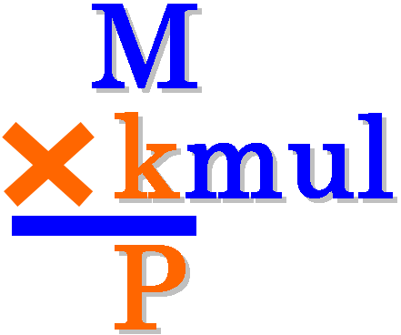

==================
 kmul user manual
==================

+-------------------+----------------------------------------------------------+
| **Title**         | kmul (Constant multiplication routine generator)         |
+-------------------+----------------------------------------------------------+
| **Author**        | Nikolaos Kavvadias                                       |
+-------------------+----------------------------------------------------------+
| **Contact**       | nikolaos.kavvadias@gmail.com                             |
+-------------------+----------------------------------------------------------+
| **Website**       | http://www.nkavvadias.com                                |
+-------------------+----------------------------------------------------------+
| **Release Date**  | 04 January 2021                                          |
+-------------------+----------------------------------------------------------+
| **Version**       | 0.1.5                                                    |
+-------------------+----------------------------------------------------------+
| **Rev. history**  |                                                          |
+-------------------+----------------------------------------------------------+
|        **v0.1.5** | 2021-01-04                                               |
|                   |                                                          |
|                   | Remove ``-gnu89`` option.                                |
+-------------------+----------------------------------------------------------+
|        **v0.1.4** | 2020-10-17                                               |
|                   |                                                          |
|                   | Add a binary decomposition algorithm.                    |
+-------------------+----------------------------------------------------------+
|        **v0.1.3** | 2016-07-29                                               |
|                   |                                                          |
|                   | Add support for C99, GNU89 data types, fix support for   |
|                   | ANSI C ones.                                             |
+-------------------+----------------------------------------------------------+
|        **v0.1.2** | 2016-04-12                                               |
|                   |                                                          |
|                   | Cumulative update; flag management cleanup, cleanup      |
|                   | scripts.                                                 |
+-------------------+----------------------------------------------------------+
|        **v0.1.1** | 2014-11-29                                               |
|                   |                                                          |
|                   | Added project logo in README.                            |
+-------------------+----------------------------------------------------------+
|        **v0.1.0** | 2014-10-16                                               |
|                   |                                                          |
|                   | Documentation updates and fixes.                         |
+-------------------+----------------------------------------------------------+
|        **v0.0.7** | 2014-06-13                                               |
|                   |                                                          |
|                   | Changed README to README.rst.                            |
+-------------------+----------------------------------------------------------+
|        **v0.0.6** | 2014-06-12                                               |
|                   |                                                          |
|                   | Updated contact information. Replaced COPYING.BSD by     |
|                   | LICENSE.                                                 |
+-------------------+----------------------------------------------------------+
|        **v0.0.5** | 2013-04-28                                               |
|                   |                                                          |
|                   | Converted documentation to RestructuredText.             |
+-------------------+----------------------------------------------------------+
|        **v0.0.4** | 2012-03-17                                               |
|                   |                                                          |
|                   | Split build-and-test scripts to "build" and "test".      |
+-------------------+----------------------------------------------------------+
|        **v0.0.3** | 2011-12-03                                               |
|                   |                                                          |
|                   | Minor README updates regarding multiple releases,        |
|                   | tutorial usage.                                          |
+-------------------+----------------------------------------------------------+
|        **v0.0.2** | 2011-11-20                                               |
|                   |                                                          |
|                   | Minor README, Makefile updates.                          |
+-------------------+----------------------------------------------------------+
|        **v0.0.1** | 2011-06-07                                               |
|                   |                                                          |
|                   | Initial release.                                         |
+-------------------+----------------------------------------------------------+

.. _Link: http://to-be-determined

1. Introduction
===============

``kmul`` is a generator of routines for optimized multiplication by an integer 
constant. In order to calculate a constant integer multiplication, it uses the 
public domain routines presented in the work:
Preston Briggs and Tim Harvey, "Multiplication by integer constants," Technical 
report, Rice University, July 1994.
This technical report implements Bernstein's algorithm documented in:
R. Bernstein, "Multiplication by integer constants," Software - Practice and 
Experience, Vol. 16, No. 7, pp. 641-652, July 1986.

A simpler algorithm based on binary decomposition can also be used for
comparison.

``kmul`` emits either a NAC (generic assembly language) or an ANSI C/C99
implementation of the multiplication.

2. File listing
===============

The ``kmul`` distribution includes the following files:

+---------------------+--------------------------------------------------------+
| /kmul               | Top-level directory                                    |
+---------------------+--------------------------------------------------------+
| LICENSE             | Description of the Modified BSD license.               |
+---------------------+--------------------------------------------------------+
| Makefile            | Makefile for generating the ``kmul`` executable.       |
+---------------------+--------------------------------------------------------+
| README.html         | HTML version of README.rst.                            |
+---------------------+--------------------------------------------------------+
| README.pdf          | PDF version of README.rst.                             |
+---------------------+--------------------------------------------------------+
| README.rst          | This file.                                             |
+---------------------+--------------------------------------------------------+
| build.sh            | Build script for ``kmul``.                             |
+---------------------+--------------------------------------------------------+
| clean.sh            | Clean the files produced from ``test.sh``.             |
+---------------------+--------------------------------------------------------+
| clean2.sh           | Clean the files produced from ``test2.sh``.            |
+---------------------+--------------------------------------------------------+
| kmul.c              | The source code for the application.                   |
+---------------------+--------------------------------------------------------+
| kmul.png            | PNG image for the ``kmul`` project logo.               |
+---------------------+--------------------------------------------------------+
| rst2docs.sh         | Bash script for generating the HTML and PDF versions.  |
+---------------------+--------------------------------------------------------+
| test.c              | Sample test file.                                      |
+---------------------+--------------------------------------------------------+
| test.opt.c          | Expected optimized version of ``test.c``.              |
+---------------------+--------------------------------------------------------+
| test.sh             | Perform some sample runs.                              |
+---------------------+--------------------------------------------------------+
| test2.sh            | Another test script to perform more sample runs.       |
+---------------------+--------------------------------------------------------+

3. Installation
===============

There exists a quite portable Makefile (``Makefile`` in the current directory).
Running ``make`` from the command prompt should compile ``kmul``.

4. Prerequisites
================

- [mandatory for building] Standard UNIX-based tools (make)
- gcc (tested with gcc-3.4.4+ on cygwin/x86 and gcc-4.6+ on linux/x64)
- bash

5. kmul usage
=============

The ``kmul`` program can be invoked with several options (see complete option 
listing below). The usual tasks that can be accomplished with ``kmul`` are:

- generate a NAC optimized software routine for the multiplication
- generate an ANSI C optimized software routine for the multiplication.

ANSI C routines are emitted only for a width of 32-bits (see option below).
  
``kmul`` can be invoked as:

| ``$ ./kmul.exe [options]``

The complete ``kmul`` options listing:
  
**-h**
  Print this help.
  
**-d**
  Enable debug/diagnostic output.

**-bindecomp**
  Use binary decomposition instead of the Bernstein-Briggs algorithm.

**-mul <num>**
  Set the value of the multiplier. Default: 1.
  
**-width <num>**
  Set the bitwidth of all operands: multiplier, multiplicand and product. 
  Default: 32.
 
**-signed**
  Construct optimized routine for signed multiplication.

**-unsigned**
  Construct optimized routine for unsigned multiplication (default).
  
**-nac**
  Emit software routine in the NAC general assembly language (default).
  
**-ansic**
  Emit software routine in ANSI C (for widths up to 32 bits).

**-c99**
  Emit software routine in C99 (for widths up to 64 bits).

Here follow some simple usage examples of ``kmul``.

1. Generate the ANSI C implementation of the optimized routine for ``n * 11``.

| ``$ ./kmul.exe -mul 11 -width 32 -unsigned -ansic``
  
2. Generate the NAC implementation of the optimized routine for ``n * (-7)``.

| ``$ ./kmul.exe -mul -7 -width 32 -signed -ansic``
  
3. Generate the ANSI C implementation of the optimized routine for ``n * 23``  
   with debugging output.

| ``$ ./kmul.exe -mul 23 -width 32 -unsigned -ansic -d``

4. Generate the C99 implementation of the optimized routine for the signed 
   ``n * 23`` multiplication and for a data width of 17 bits.

| ``$ ./kmul.exe -mul 23 -width 17 -signed -c99``

  
6. Quick tutorial
=================

``kmul`` can be used for arithmetic optimizations in user programs. Assume 
the following user program (``test.c``):

::

  // test.c
  #include <stdio.h>
  #include <stdlib.h>
  int main(int argc, char *argv[]) {
    int a, b;
    a = atoi(argv[1]);
    b = a * 23;
    printf("b = %d\n", b);
    return b;
  }

This file is compiled and run as follows with one additional argument:

| ``$ gcc -Wall -O2 -o test.exe test.c``
| ``$ ./test.exe 155``

and the expected result is:

| ``$ b = 3565``

The user can apply ``kmul`` for generating a constant multiplication routine 
for ``a*23``:

| ``$ ./kmul -mul 23 -width 32 -signed -ansic``
  
and the corresponding routine is produced (local variables ``t5`` to ``t15`` can be 
deleted by the user; the compiler will be optimize them away eventually). Then, 
the user should edit a new file, let's say ``test.opt.c`` and include the produced 
routine. The resulting optimized source file should be as follows:

::

  // test.opt.c
  #include <stdio.h>
  #include <stdlib.h>

  long kmul_o_s32_p_23 (long x)
  {
    long t0;
    long t1;
    long t2;
    long t3;
    long t4;
    long t5;
    long t6;
    long t7;
    long t8;
    long t9;
    long t10;
    long t11;
    long t12;
    long t13;
    long t14;
    long t15;
    long y;
    t0 = x;
    t1 = t0 << 1;
    t2 = t1 + x;
    t3 = t2 << 3;
    t4 = t3 - x;
    y = t4;
    return (y);
  }

  int main(int argc, char *argv[]) 
  {
    int a, b;
    a = atoi(argv[1]);
    b = kmul_o_s32_p_23(a);
    printf("b = %d\n", b);
    return b;
  }

This file is compiled and run as follows with one additional argument:

| ``$ gcc -Wall -O2 -o test.opt.exe test.opt.c``
| ``$ ./test.opt.exe 155``
 
The target platform compiler (e.g., ``gcc`` or ``llvm``) is expected to inline
the ``kmul_o_s32_p_23`` function at its call site.

7. Running tests
================

In order to build and run a series of sample tests do the following:

| ``$ ./build.sh``
| ``$ ./test.sh``

or for a more extensive set of tests:

| ``$ ./test2.sh``

To clean-up the produced files and only these use:

| ``$ ./clean.sh``

or 

| ``$ ./clean2.sh``

for ``test.sh`` and ``test2.sh``, correspondingly.
